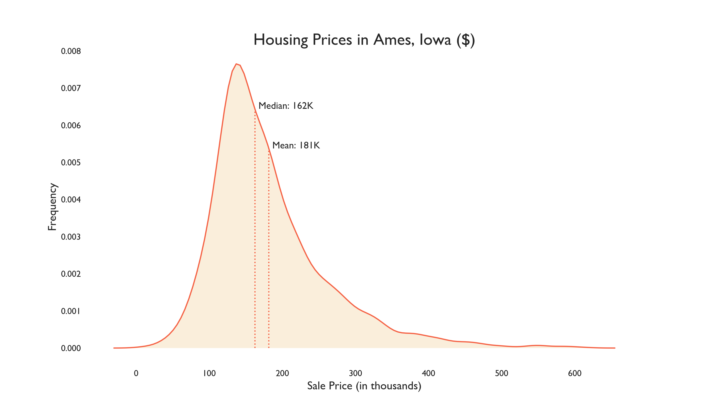
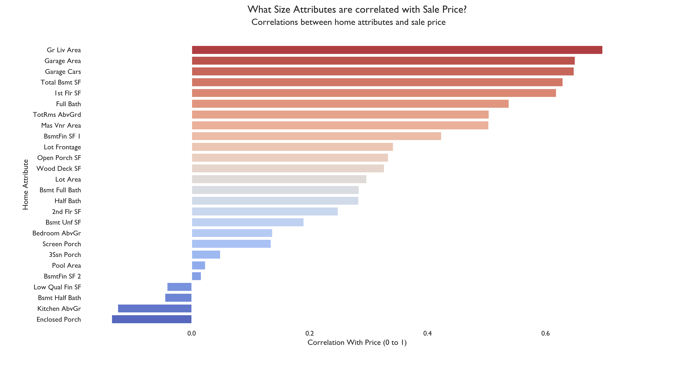
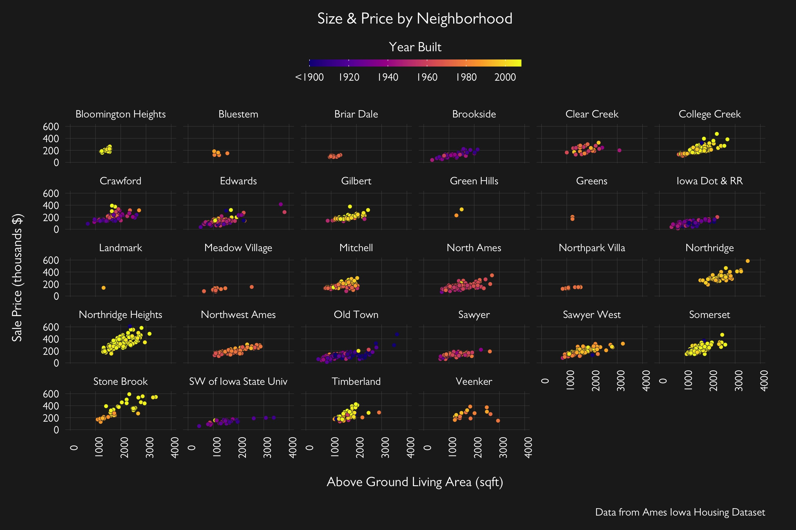
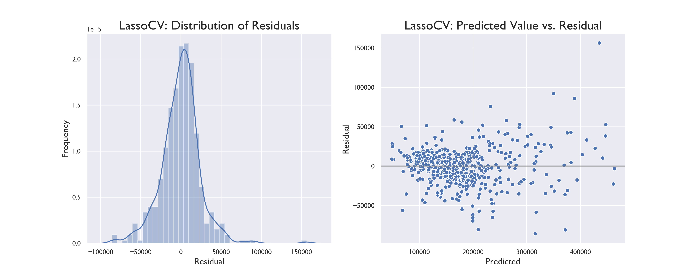

# Ames Housing Data and Kaggle Challenge

For this project, the objective is to predict housing sale price in Ames, Iowa using various features and attributes describing the home property, e.g. Year Built, Neighborhood, Roof Type, Above Ground Living Squareefeet. 

Models used for this project include a differt types of regression: **Linear Regrsesion**, **Lasso Regression**, and **Ridge Regression**. The best model was then determined by reviewing both **R2** and **RMSE** scores. Test scores yielding the predicted Sale Price were then submitted to Kaggle.

Full presentation with results and findings can be found [here](https://github.com/tashapiro/predicting-housing-prices/blob/main/presentation/ames-presentation.pdf).

## :mag_right: Background

**About Housing Sale Prices**

Based on [online research](https://www.opendoor.com/w/blog/factors-that-influence-home-value), non-commercial real estate prices appear to be influenced by a few specific categories:

| Factor                | Description                                                                                   |
|:----------------------|:----------------------------------------------------------------------------------------------|
| Location              |  can be specific to neighborhood, distance to school, and proximity to recreational/amenity spots   |
| Size                  |  total square footage, homes are   commonly appraised by $ per square foot                    |
| Age                   |  year built, was the house recently renovated/upgraded?                                       |
| Quality/Condition     |  the quality and condition of a   home, if home is in need of repair, will drive price down   |

**About Ames, Iowa**

Description about Ames, Iowa taken from [Wikipedia](https://en.wikipedia.org/wiki/Ames,_Iowa):

>Ames is a city in Story County, Iowa, United States, located approximately 30 miles (48 km) north of Des Moines in central Iowa. It is best known as the home of Iowa State University (ISU), with leading agriculture, design, engineering, and veterinary medicine colleges. A United States Department of Energy national laboratory, Ames Laboratory, is located on the ISU campus.

## :triangular_ruler: Data

The data set was taken from **Ames, Iowa Assessor’s Office**. A data dictionary describing the variables can be found [here](http://jse.amstat.org/v19n3/decock/DataDocumentation.txt),

Excerpt about the Ames Iowa Housing Pricing Data from [Dean DeCock](http://jse.amstat.org/v19n3/decock.pdf):

> ...a data set describing the sale of individual residential property in Ames, Iowa
from 2006 to 2010. The data set contains 2930 observations and a large number of explanatory
variables (23 nominal, 23 ordinal, 14 discrete, and 20 continuous) involved in assessing home
values.

The data was split into a train and test dataset (70/30 split). Students were given the Sale Price in the train data, while Sale Price was removed from the test data. Models based on train data were then applied to test data to yield the predicted Sale Price.

## :bar_chart: EDA

### Examining Sale Price Distribution: What does the market look like? 

Housing prices in the dataset are right-skewed: there are some expensive outliers that do not make the data set normally distributed. These outliers will impact the model.

### Examining Correlations: What are some noticeable relationships between housing attributes and sale price? 

Correlation analysis was split into two categories: 1) continuous/discrete variables describing size and 2) continuous/discrete variables describing other attributes, e.g. quality. 

After initial review, there were a few variables that immediately stood out with strong, positive correlations to sale price, e.g. Above Ground Living Area (Gr Liv Area), Garage Area, Total Basement Squarefeet, and Overall Quality. 

With additional analysis to observe correlations amongst the features (e.g. Garage Area vs. Gr Liv Area), there were some variables that were strongly correlated to other house attributes. For instance, Garage Area was highly correlated with Garage Cars. We can deduce some level of colinearity between certain variables using these correlations (Garage Area and Garage Cars are both Garage size measurements). To simplify the model, the attribute with the stronger positive correlation to price was used while the other omitted (e.g. Garage Cars can be dropped).

### Examining Price, Size, and Age by Neighborhood: What's Good in the Neighborhood? 

It appears that the make-up of homes varies from neighborhood to neighborhood, which means we cannot generalize attributes for all of Ames, Iowa, we need to consider samples based on divisions within Ames. 

For instance, Northridge Heights has a higher concentration of newer, bigger, and more expensive homes, while Old Town, true to it's name, has older homes with overall lower prices. 

We can also observe that the data does not have an equal sample per neighborhood, there are fewer observations in neighborhoods such as Greens and Green Hills. If neighborhood is included as a variable in the model, it might not perform well predicting prices in neighborhoods with small sample sizes.

## :chart_with_upwards_trend: Models

Three different types of regression models were applied to the cleaned train and test data sets. Since test data set did not inclue Sale Price (this data set was used only to produce predictions for Kaggle), all scores are based on an additional split to the train data set.

### Model Scores

| #   | Desc                                                   | Train |  Test |  RMSE  |
|:---:|:-------------------------------------------------------|:-----:|:-----:|:------:|
| 1   | Linear   Regression Numeric Variables Only             | 0.826 | 0.842 | 31,568 |
| 2   | Linear   Regression Numeric & Categorical Variables    | 0.897 | 0.901 | 24,959 |
| 3   | Linear   Regression Overall Qual as Dummy Variable     | 0.903 | 0.906 | 24,361 |
| 4   | Linear   Regression Overall Qual Dummy & Sqft Outliers | 0.865 | 0.882 | 26,882 |
| 5   | Ridge   Regression                                     | 0.903 | 0.907 | 24,275 |
| 6   | LassoCV   Regression                                   | 0.903 | 0.908 | 24,148 |
| 7   | Ridge with Alpha 26 (GridSearch Tuning)                | 0.903 | 0.908 | 24,129 |

### Interpreting Residuals

LassoCV and Ridge with GridSearch Tuning yielded the best results, both with R2 and RMSE scores (0.9 and ~24.1K respectively). Upon observation of residuals vs. predicted sales prices, we notice that the model does not perform well with predicting homes over ~200K - there is a higher variability with residuals, and a noticeable outlier that is most likely skewing MSE and RMSE. 

## :memo: Conclusion & Recommendations

- **Inferences** - there is a strong relationship with size and quality with price. Renovating homes and investing in updating homes might improve a homeowner's price appraisal (renovated homes have higher mean sale price vs. non renovated homes). 
- **Location Sensitive** - this model is specific to **Ames, Iowa**, we should not use this model to predict prices outside of Ames. If we wanted to predict prices in New York, New York, the distribution of sales price and overalll make-up of homes may look radically different.
- **Point In Time** - it is important to remember this data set is as of 2010. If we applied this model to homes today, we might expect different results due to fluctuations in the housing market (e.g. inflation rates, interest rates, etc).
- **Model is weak at predicting expensive homes** - from residual analysis, there are some extreme outliers. This is most likely due to the right skewed 
- **Feature Engineering** - there may be unseen variables that have a relationship with price or variables that can be factored together to produce a better variable. For instance, distance to Iowa State University may have an impact on price, future research could create a mean distance based on Neighborhood and appl
- **Factor out size from analysis** - size is a major factor with home price (based on research and confirmed with high correlation). EDA may be improved by viewing other non-size variables vs. price per square footage instead of total price.
- **Explore Ordinal Variables** - ordinal variables may not be evenly weighted, e.g. "Excellent" can be 2pts higher than "Good." My best performing model dummified Overall Quality (discrete ordinal variable) - this yielded higher scores vs. using Overall Quality as a numeric value.
distribution of the dataset, we have more data points under 200K that makes our model better at predicting homes in the 100-200K range.
- **Consider Other Models** - regression model may be too simple for predicting house price. Future research should test other supervisied learning models, e.g. Decision Tree.

